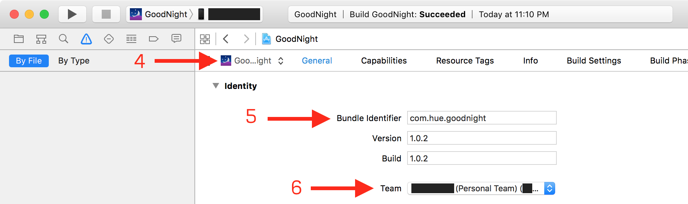

# Installing GoodNight

1. Download the [latest version of Xcode][1].
2. Download and unzip the [.zip of GoodNight][2].
3. Open `GoodNight.xcodeproj` in Xcode.
4. Select **GoodNight**, then open the **General** tab.
5. Change **Bundle Identifier** to `com.<something>.goodnight` where
`<something>` is some arbitrary string of characters a-z.
6. Change **Team** to your own Apple ID.
7. Click **Fix Issue** below **Team**.

8. Open **Capabilities** tab and make sure **App Groups** is enabled. 
9. Enter `group.com.<something>.goodnight` as group name (click +) and check this group.
10. Click **Fix Issue** in the App Group section below **Steps**.
11. Repeat 4-10 for **GoodNight-Widget**. (Make sure the **Bundle Identifier** has
the same arbitrary string as the first one.)
12. Open `PrefixHeader.pch` and also change the definition of **appGroupID** to `group.com.<something>.goodnight`.
13. Select your iOS Device in Xcode, then unlock it (type in your passcode if you
have one).

14. Hit `⌘R` to install. (You may get "Process launch failed: Security." That's
OK.)
15. On your iOS device, go to **Settings → General → Profile (or Device Management in iOS 8) →
\<your Apple ID\>** and hit **Trust**.  Note that **Profile** can also be known as **Profiles** or **Profiles & Device Management**. 
16. If your device was not connected to the Internet when you trusted the app developer above, you now need to connect to the Internet and tap the **Verify App** button.
17. Launch the GoodNight app on your iOS device from the Home screen.

Note: If you'd like to test your own version of GoodNight, you must select
"Generic iOS Device", or your own device (if plugged in, of course), to
successfully compile and build GoodNight without errors. Please ensure that you
are not building for the iOS Simulator.

[1]: https://itunes.apple.com/us/app/xcode/id497799835
[2]: https://github.com/anthonya1999/GoodNight/archive/master.zip
